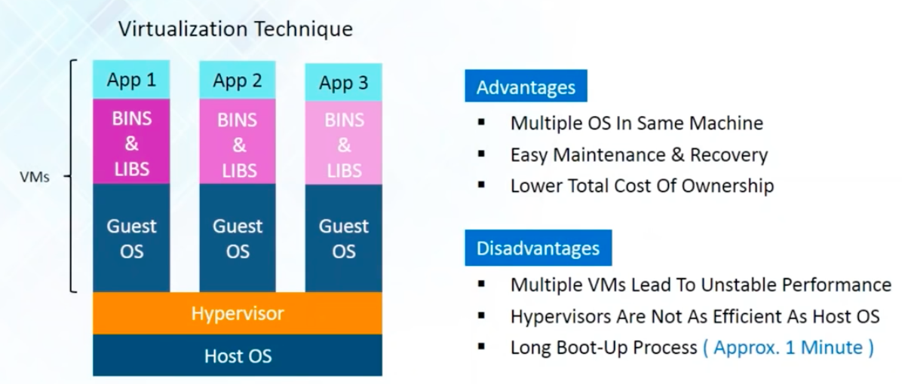
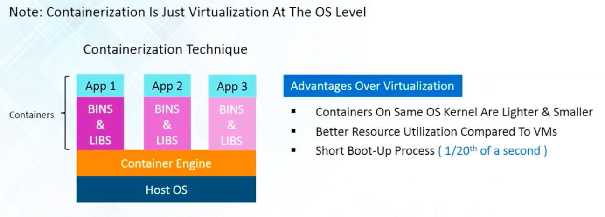
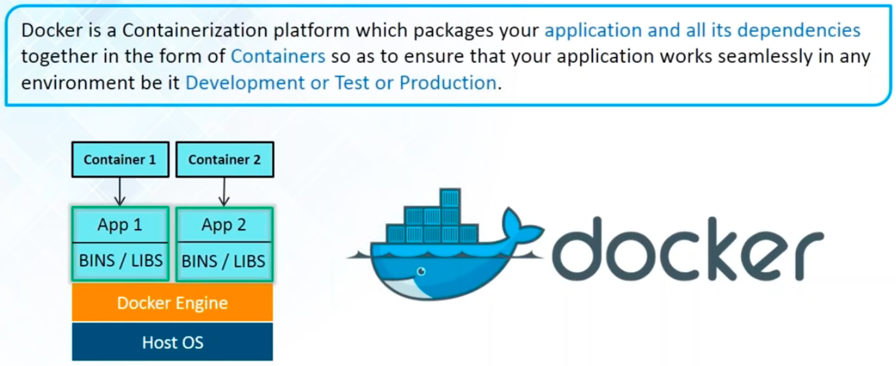
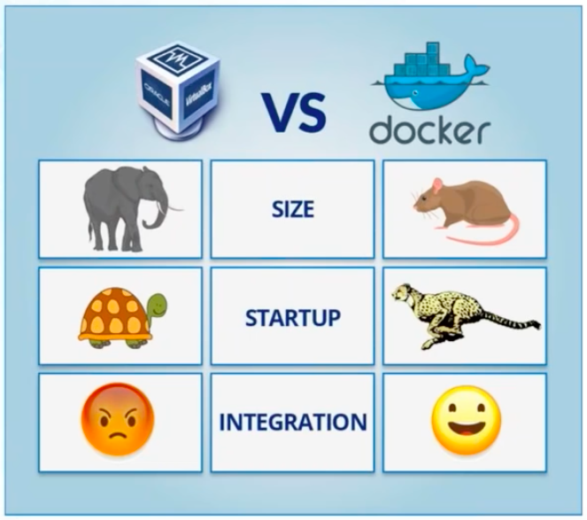
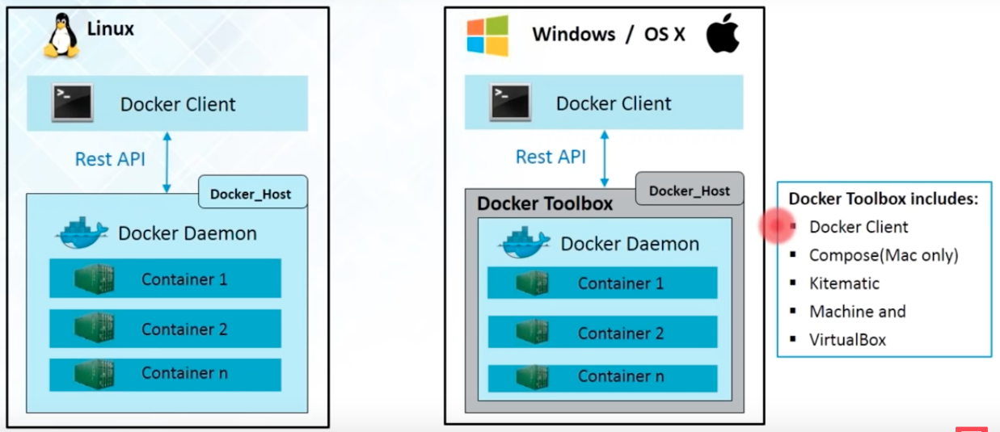
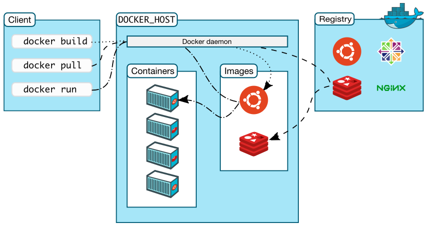

# Source

> These notes are created while watching docker tutorial from https://www.youtube.com/watch?v=h0NCZbHjIpY

# Agenda

In this video tutorial by Edureka, we will cover following 4 topics.


- Virtualization vs. Containerization
- What is Docker?
- Docker Architecture.
- Hands-on

## Difference between virtualization and containerization

### Virtualization



- A technique of importing guest operating system on host operating system.
- This technique was revolutionary in the beginning because:
    - Developers can run multiple on on same machine and can use all of them at same time.
        - Different from duel boot as in duel boot you can use only one OS at a time.
    - This eliminate need of extra hardware and allow easy recovery in case of failure conditions.
    - Lower total cost of hardware.
- It also have its own disadvantages like:
    - Running multiple OS in same host OS degrades system performance.
        - because each guest OS has its own ket of kernel and other dependency libraries. 
    - Each guest OS need up to a minute to boot, which is not suitable where system performance is critical.
    
### Benefit of Containerization over virtualization.



- Containerization is a technique of virtualization at OS level.
- Virtualization brings abstraction to the hardware, containerization brings abstraction to the software.
- Containerization is also a type of virtualization.
- Containerization is more efficient as there is no guest OS.

## Docker

### What is Docker?



- Docker is a software containerization platform which packages your **application and all its dependencies** together in the form of **containers** so at to ensure that your application works seamlessly in any environment be it **Development or Test of Production.**
- Every application goes in separate container, which has its own set of libraries and dependencies.
- This ensures there is process level isolation.
- This also ensures that working environment one application is same for everyone.

### Docker vs VM



| Propoerty   | VM                    | Docker    |
|-------------|-----------------------|-----------|
| Size        | Huge                  | Small     |
| Startup     | Takes time            | Very fast |
| Integration | Possible but complex. | Easy      |

### Who can use Docker

**Answer: Everyone involved from development to deployment & monitoring server**

**Developers** can write code without worrying about the testing/production environment.
**QA** can test with minimal dependencies on their system. It can also setup specialized testing environment like selenium, which developers generally do not need.
**System administrators** need not to worry about infrastructure as Docker can easily scale up / scale down the number of systems.

> Thus docker containers provide an entire runtime environment, an application, all irs dependencies, libraries and other binaries, and configuration files needed to run it, bundled into one package.

## How docker works?



Docker works a client server application. Docker engine provides:

- Docker host, which has a long running process called **Docker Daemon** and
- a command line interface called **Docker client**.

We can use docker client to communicate with docker (host). Docker client internally use REST API with combination of socket IO and TCP/IP connection to communicate with docker host.


On Windows and Mac OS, there is an additional component called **Docker toolbox**. On linux, docker basically use linux kernel of host operating system even for container OS. However on windows and Mac OS do not have linux kernel. Thus docker toolbox provide equivalent of linux kernel on these two operating systems. It contains:

- Docker client
- Compose (Mac only)
- Kitematic
- Machine and 
- Virtual box

## Docker images and containers

Docker images

- Docker images are read only template used to create containers. 
- Build by docker users.
- Stored on docker hub or local registry.

Docker containers

- Isolated application platform.
- It contains whole application and all of its dependencies.
- Build from one or more images.

> Thus at very high level, we can consider images are installers of any computer program and containers are installed instance. However these installed instance too, are portable.

## Docker registry

- Docker images are stored in docker registry.
- Registry can be public or private.
- **Docker hub** is largest public docker registry.

## Docker architecture



In general, there are three major parts of docker architecture.

- Docker client
- Docker host, which contains docker daemon, containers and images (locally) and
- Docker registry, which is used to store docker images so that they cna be shared.
    - Docker hub is one such public registry. It is like github for docker images.
    
There are three major commands we can fire form docker client:

- `docker build` is used to make docker images. Docker daemon make images as per our input and save it registry (local or docker hub)
    - It is shown with dotted line in above image.
- If we want to use an existing image, we can use `docker pull` command. It will pull image from repository and save it locally in docker host.
    - It is shown with dashed line in above figure.
- As discussed above, images are like installed. If we want to run a image, we need container. `docker run` command creates container using images.
    - It is shown as dot-dash line in above figure.
    
## Docker commands

To pull docker image from docker hub, we use following command. In the command, `tag` mentions the version of image.

```bash
docker pull <image-name:tag>
```

To run docker images, we can run any of following commands:

```bash
docker run <image-name:tag>
docker run <image-id>
```

List down all the images in our system

```bash
docker images
```

To list down all the **running** containers:

```bash
docker ps
```

To list down all the containers (even if they are not running):

```bash
docker ps -a
```

Starting, stopping & removing containers

```bash
docker start <container id>
docker stop <container id>
docker rm <container name>
```

> Note: We can't remove running container. We must first stop it, before removing.

To remove an image, we can use either of following commands

```bash
docker rmi <image id>
docker rmi <repo:tag>
```

## Building our own docker images

Before we start building images, following are few important properties of docker image.

- Images have multiple layers.
- Each layer in an image, is an image of its own.
- Each image can extend another image. That another image becomes base layer, which is read-only.
- Any change to an image are saved as layers on top of the base image layer.
- Containers are generated by running the image layers, which are stacked one above the other.

## Revise:

We discussed:

- **Docker Daemon:** Daemons run on host machine. Daemons create and manage Docker objects like Images, Containers, networks, volumes data etc. The user does note directly interact with the daemon, but instead through docker client.
- **Docker client:** Primary user interface to Docker. It accepts commands from the user and communicates back and forth with a Docker daemon.
- **Docker images:** Images are used to create Docker containers. Docker provides a simple way to build new images or update existing images. docker images are build component of Docker.
- **Docker registry:** Registries store images. These are public or private stores from which you upload/download images. This can be done in Docker Hub, which id Docker's version of Github. Docker registries are the distribution component of Docker.
- **Docker containers:** Containers are created from Docker images. They hold everything that is needed for an application to run. Each container is an isolated and secure application platform. Docker containers are the run component of Docker. 