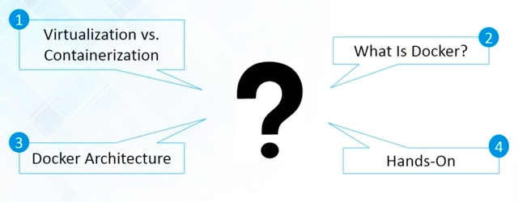

# Source

> These notes are created while watching docker tutorial from https://www.youtube.com/watch?v=h0NCZbHjIpY

# Agenda

In this video tutorial by Edureka, we will cover following 4 topics.

- Virtualization vs. Containerization
- What is Docker?
- Docker Architecture.
- Hands-on

## Difference between virtualization and containerization

